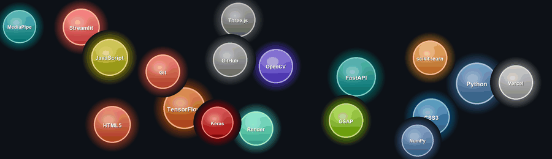

<div align="center">

[](https://github.com/Utkarsh4410)

</div>

---

##  About Me

```python
class Utkarsh:
    def __init__(self):
        self.name       = "Kumar Utkarsh"
        self.role       = "Developer & ML Enthusiast"
        self.languages  = ["Python", "JavaScript", "HTML", "CSS"]
        self.interests  = ["Machine Learning", "Computer Vision", "Web Development", "FinTech AI"]
        self.deployed   = ["Render", "Vercel", "Streamlit Cloud", "GitHub Pages"]
        self.current_projects = [
            "Indian Stock Market Predictor 📈 — LSTM + Sentiment AI",
            "KAYA — AI Pregnancy Assistant 👶",
            "3D Interactive Climate Change Website 🌍",
            "Hand Gesture → English Translator 🤟",
            "Zoonet — Animal Classification 🦁",
        ]
        self.fun_fact   = "I build intelligent AI apps and ship them live to the web!"

    def say_hi(self):
        print("Thanks for dropping by! Let's build something awesome together! 🚀")

me = Utkarsh()
me.say_hi()
```

---

## 🔥 Recent Updates

- 📈 **[Live] Indian Stock Market Predictor** — LSTM Neural Network + AI News Sentiment deployed on [Render](https://indian-stock-predictor-u36d.onrender.com) with a premium dark-mode frontend.
- 🏗️ **Built REST API** with FastAPI for the Stock Predictor, enabling a separate Vercel-deployable frontend.
- 👶 **Launched [KAYA](https://github.com/Utkarsh4410/KAYA)** — AI-powered Virtual Doula & Pregnancy Health Tracker on Streamlit Cloud.
- 🌍 **Upgraded [Climate Change](https://github.com/Utkarsh4410/climate-change)** website to a modern 3D experience using Three.js & GSAP.

---

## 🛠️ Tech Stack

<div align="center">



</div>

---

## 🚀 Featured Projects

<div align="center">

<a href="https://github.com/Utkarsh4410/indian-stock-predictor">
  
</a>
<a href="https://github.com/Utkarsh4410/KAYA">
  
</a>
<a href="https://github.com/Utkarsh4410/climate-change">
  
</a>
<a href="https://github.com/Utkarsh4410/hand-gesture-english">
  
</a>

</div>

---

## 📊 GitHub Stats

<div align="center">


</div>

<div align="center">


</div>

---

## 🏆 GitHub Trophies

<div align="center">


</div>

---

## 📈 Contribution Graph

<div align="center">


</div>

---

## 🐍 Contribution Snake

<div align="center">

<picture>
  <source media="(prefers-color-scheme: dark)"  srcset="https://raw.githubusercontent.com/Utkarsh4410/Utkarsh4410/output/github-contribution-grid-snake-dark.svg"/>
  <source media="(prefers-color-scheme: light)" srcset="https://raw.githubusercontent.com/Utkarsh4410/Utkarsh4410/output/github-contribution-grid-snake.svg"/>
  
</picture>

</div>

---

## 🤝 Let's Connect

<div align="center">

[](https://github.com/Utkarsh4410)
[](https://indian-stock-predictor-u36d.onrender.com)
[](mailto:ku201301@gmail.com)

</div>

---

<div align="center">


<br>

*⭐ Star my repos if you find them interesting!*

</div>


